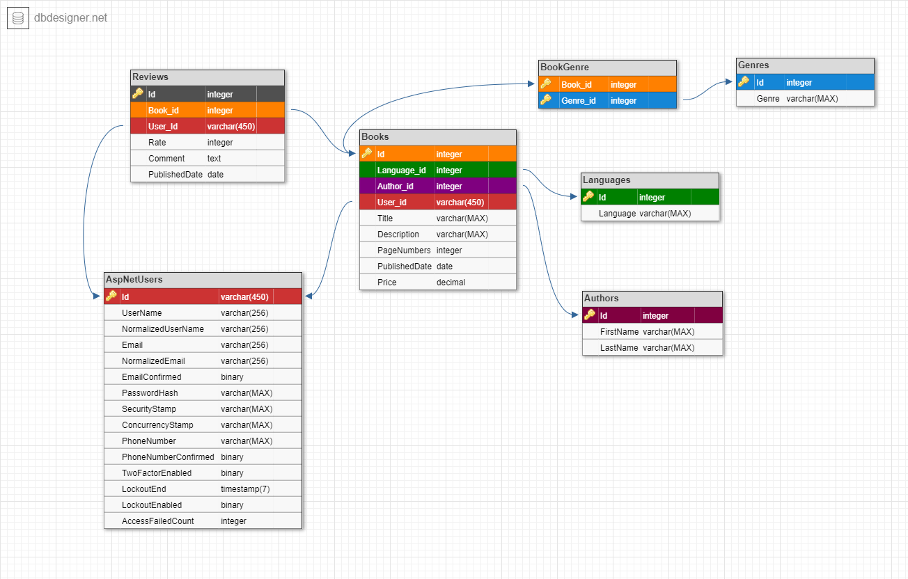

# Bookstore MVC with Clean Architecture and Mediator
Bookstore MVC is a web application built using the Model-View-Controller (MVC) architectural pattern with a focus on Clean Architecture and Mediator pattern. It provides a structured and modular approach to developing robust and maintainable applications.
## Architecture Overview
The application follows a Clean Architecture pattern, which promotes separation of concerns and maintainability. It consists of the following layers:
+ Domain: Contains the core domain models, entities, and interfaces that define the business logic.
+ Application: Implements the use cases or application-specific operations by utilizing the domain layer.
+ Infrastructure: Contains the implementations of data access, external services, and other infrastructure-related components.
+ Presentation: Includes the user interface components, such as controllers, views, and view models.
## Mediator Pattern
The application also utilizes the Mediator pattern to decouple the communication between various components. The Mediator acts as a central hub for handling requests and coordinating the interactions between different parts of the system.
## Technologies and Libraries Used
+ ASP.NET Core MVC
+ Entity Framework
+ AutoMapper
+ Bogus
+ Fluent Validation
+ Entity Framework Identity
+ Mediator
## Database schema
